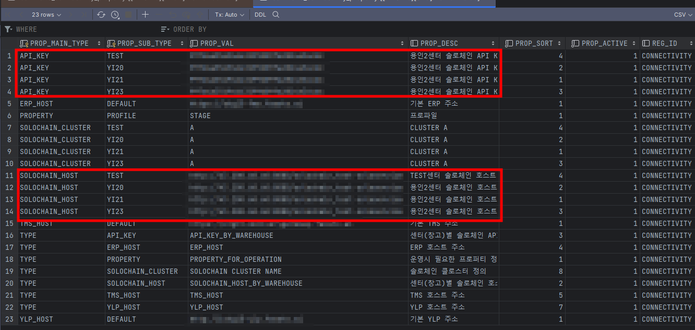
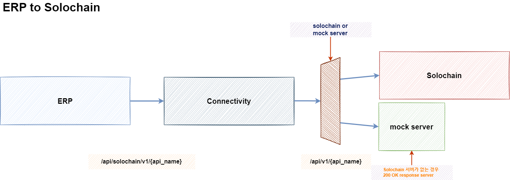
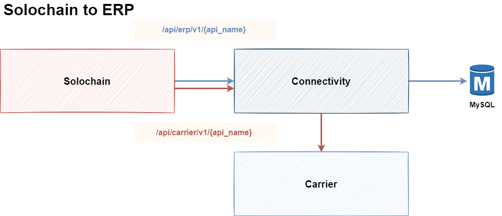

# fassto_connectivity

## Project 구조

## Branch 관리 전략
* main branch
* feature/{JIRA TICKET NUMBER}

### 병합 방식
* feature/{JIRA TICKET NUMBER} commit
* PR 요청 to main
* 정상적으로 배포가 완료 된 이후 GitHub에서 feature/{JIRA TICKET NUMBER} 브랜치 제거

---
# CLUSTER 대응방법
현재 15 CENTER 에서 향후 150개 CENTER까지 늘려감에 따라서 센터를 GROUPING 하여 CLUSTER로 구성을 함

connectivity_property 테이블을 이용하여 cluster 대응을 할 수 있음
각 warehouse code 별로 end point url 과 api key를 알 수 있게 구성되어 있음

---
# SCHEDULER (repository: connectivity_scheduler)

* Daily Stock 과 같은 scheduler 작업을 등록, 수정, 삭제 할 수 있게 API를 제공
* Scheduler에 대한 실제 동작은 connectivity_scheduler server에서 처리

---
# API 호출 관계

## ERP to Solochain

### API 
* ERP <--> Connectivity: /api/solochain/v1/{api_name}
* Connectivity <--> Solochain: /api/v1/{api_name}

## Solochain to ERP (or Carrier)

### API
* Solochain <--> Connectivity: /api/solochain/v1/{api_name}
* Connectivity <--> DB: API 필요 없음
* Connectivity <--> Carrier: 확인 필요

# Accept-Language
* Korean: ko
* English: en
