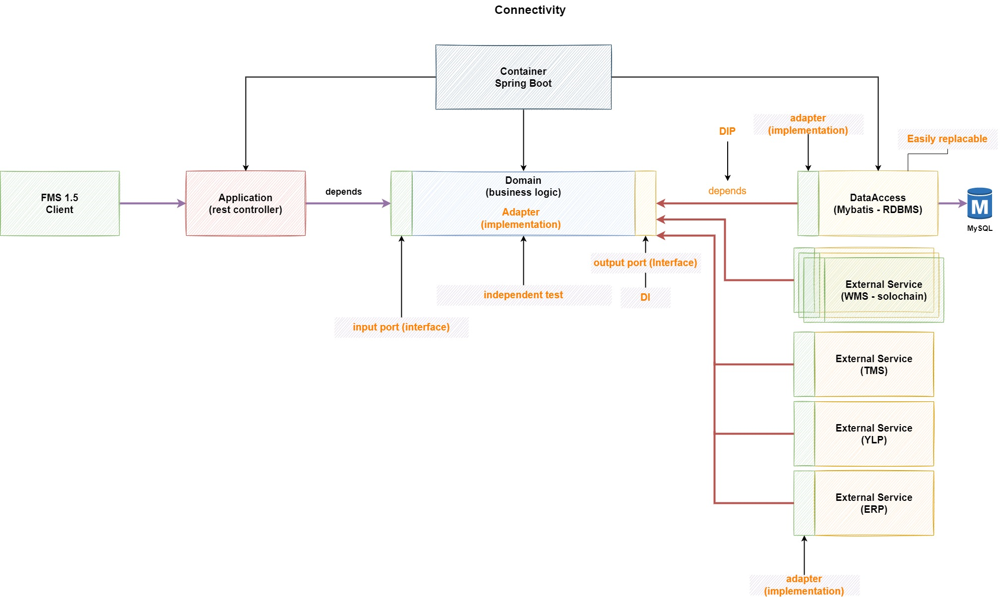

# fassto_connectivity

## Project 구조

# API 호출 관계

## ERP to Solochain

### API 
* ERP <--> Connectivity: /api/solochain/v1/{api_name}
* Connectivity <--> Solochain: /api/v1/{api_name}

## Solochain to ERP (or Carrier)

### API
Connectivity: /api/solochain/v1/{api_name}

# Accept-Language
* Korean: ko
* English: en
